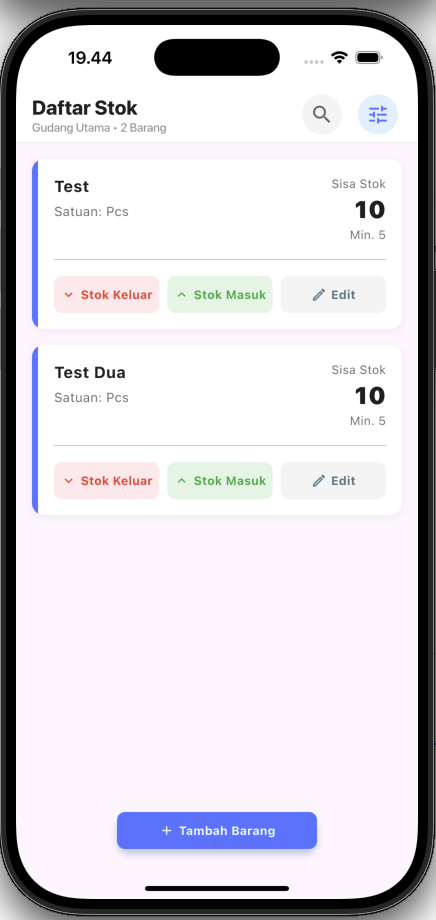
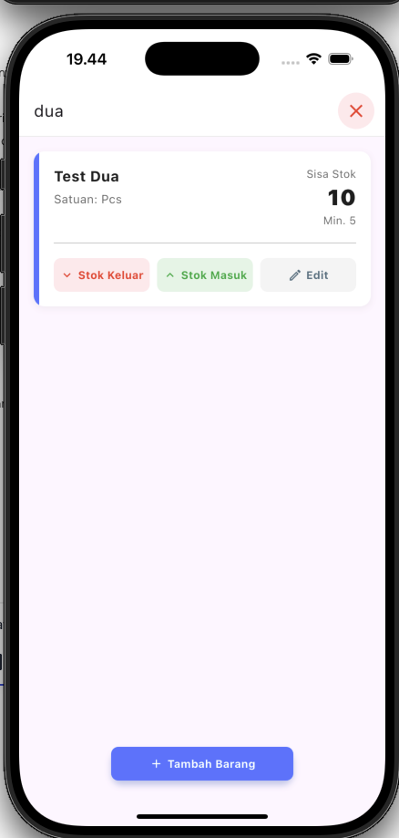
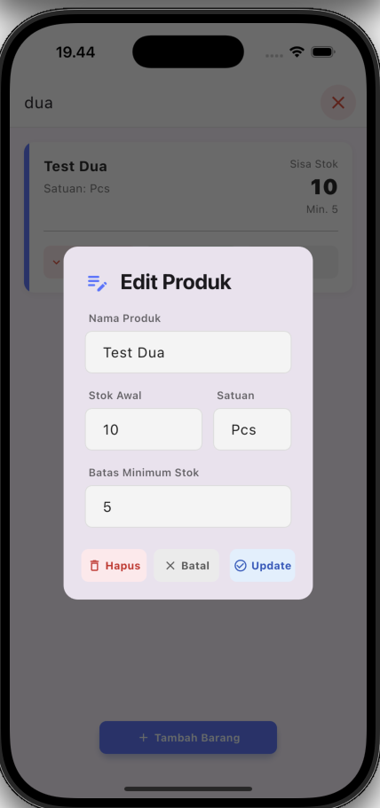

# 📦 Inventory Management App (StockMate)

A modern, efficient, and clean inventory management application built with **Flutter**. Designed to help small businesses track stock levels, manage product details, and monitor inventory status in real-time.


## 📱 Screenshots

|            Dashboard List            |          Search Mode           |         Add/Edit Item          |
| :----------------------------------: | :----------------------------: | :----------------------------: |
|  |  |  |

## ✨ Key Features

- **Real-time Inventory Tracking**: Monitor stock levels with visual cues (Low stock indicators).
- **Smart Search**: Instantly find products using a dynamic search bar integrated into the AppBar.
- **CRUD Operations**: Create, Read, Update, and Delete items seamlessly using a local SQLite database.
- **Clean UI/UX**:
  - Modern card layouts with color-coded indicators.
  - Custom global widgets for consistency.
  - Interactive dialogs for adding/editing data.
- **Safe Deletion**: Confirmation dialogs to prevent accidental data loss.

## 🛠 Tech Stack

- **Framework**: Flutter SDK ^3.7.2
- **Language**: Dart
- **State Management**: `provider` (MVVM Pattern)
- **Local Database**: `sqflite` (SQLite)
- **Environment Config**: `flutter_dotenv`
- **Path Utils**: `path`

## 📂 Project Architecture (MVVM)

This project follows the **Model-View-ViewModel (MVVM)** architectural pattern to ensure separation of concerns and testability.

## Pattern Used

- **Repository Pattern**
  - Abstraction: lib/repository/base_repository.dart (Kontrak/Interface).
  - Implementation: lib/repository/item_repository.dart.
- **DAO (Data Access Object) Pattern**
  - Separating SQL queries (SELECT \* FROM ...) from the Repository logic: lib/data/local/item_dao.dart
- **Observer Pattern**
  - ChangeNotifier ( in ViewModel). context.watch<ItemViewModel>() or Consumer (in View). notifyListeners().
- **Strategy Pattern**
  - Implementation: abstract class BaseRepository<T>.
- **Singleton Pattern**
  - Implementation: DatabaseService (lib/data/local/database_service.dart).
- **Factory Method Pattern**
  - Implementation: DataResponse.success(...) / DataResponse.error(...): Factory constructors
- **Dependency Injection**
  - Implementation: Provider (main.dart atau MultiProvider) and performing dependency injection of the ItemViewModel instance
- **Barrel File Pattern**
  - Implementation: files like widgets.dart, pages.dart, repository.dart to simplify import in one file
- **Composite Pattern**
  - Implementation: Widget CustomAppBar and CustomTextField

### Key Components:

- **Repository Pattern with DAO**:
  - **DAO (`item_dao.dart`)**: Handles raw SQL queries, keeping database logic isolated.
  - **Repository (`base_repository.dart`)**: Defines the contract for data operations, making the app loosely coupled.
- **Generic Response Wrapper**:
  - Uses `DataResponse<T>` (`data_response.dart`) to standardize API/DB responses, encapsulating Data, Status, and Messages in a single object.
- **Centralized Error Handling**:
  - Custom exceptions (`app_exception.dart`) ensure errors are caught and transformed into user-friendly messages.
- **Modular Widgets**:
  - UI components are broken down into reusable widgets (`CustomAppBar`, `CustomTextField`) found in `view/widgets/`.

## 🚀 Getting Started

Follow these steps to run the project locally.

### Prerequisites

- Flutter SDK installed
- Android Studio / VS Code
- Android Emulator or Physical Device

### Installation

1.  **Clone the repository**

    ```bash
    git clone [https://github.com/ibudiana/stockmate.git](https://github.com/ibudiana/stockmate.git)
    cd stockmate
    ```

2.  **Install dependencies**

    ```bash
    flutter pub get
    ```

3.  **Environment Configuration**
    This project uses `flutter_dotenv` to manage environment variables.

    - Create a file named `.env` inside the `assets/` folder.
    - _(Optional)_ Add your specific configuration keys if needed. For now, you can leave it empty or add a dummy key:
      ```env
      DB_NAME=inventory.db
      ```

4.  **Run the App**
    ```bash
    flutter run
    ```

## ⚠️ Database Note

The app uses `sqflite` which stores data locally on the device.

- **Android/iOS**: Data persists between app restarts.
- **Uninstalling**: Uninstalling the app will clear the database.

## Reflection on Building StockMate

Working on the StockMate inventory application taught me a lot about building scalable Flutter apps. I learned how to implement the MVVM (Model-View-ViewModel) architecture properly. By separating the UI from the business logic, my code became much cleaner and easier to manage. I also learned the importance of the Repository and DAO patterns, which help organize how the app saves and loads data from the database.

One of the biggest challenges I faced was handling the search functionality. I had to figure out how to update the list dynamically while keeping the UI responsive. Changing the CustomAppBar into a stateful widget to handle the search input was a clever solution that kept the main page code clean.

Additionally, I improved my UI skills by creating reusable global widgets like CustomActionButton and CustomTextField. This made the design consistent and reduced repetitive code. Overall, this assignment helped me understand how to structure a professional mobile application that is ready for real-world use.

## 🤝 Contributing

Contributions are welcome!

1.  Fork the project
2.  Create your feature branch (`git checkout -b feature/AmazingFeature`)
3.  Commit your changes (`git commit -m 'Add some AmazingFeature'`)
4.  Push to the branch (`git push origin feature/AmazingFeature`)
5.  Open a Pull Request

## 📝 License

Distributed under the MIT License. See `LICENSE` for more information.
